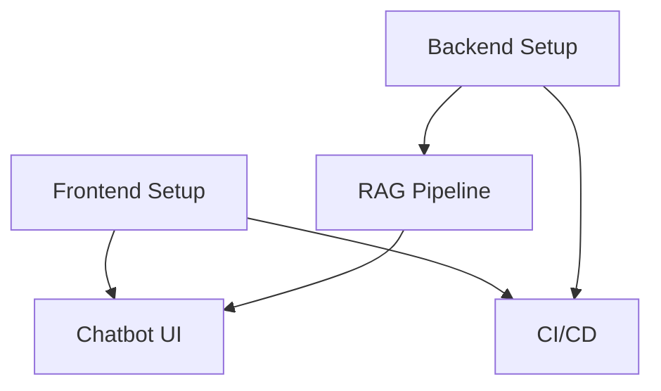

# Implementation Plan: Initial Project Setup

**Branch**: `001-initial-project-setup` | **Date**: 2025-12-02 | **Spec**: [specs/001-initial-project-setup/spec.md](specs/001-initial-project-setup/spec.md)
**Input**: Feature specification from `specs/001-initial-project-setup/spec.md`

## Summary

This plan outlines the steps to create the "Physical AI & Humanoid Robotics Interactive Book + RAG Chatbot". The project will be a Docusaurus-based website with an embedded React chatbot powered by a FastAPI backend. The backend will use a RAG pipeline with Qdrant and Neon to provide answers from the book's content.

## Technical Context

**Language/Version**: Python 3.11+, TypeScript 5.x
**Primary Dependencies**: Docusaurus 3.x, React 19, MDX 3, TailwindCSS 3.x, FastAPI, LiteLLM, Qdrant, Neon
**Storage**: Qdrant (Vector DB), Neon (Postgres for metadata)
**Testing**: Playwright (E2E), pytest (backend unit tests), Vitest (frontend unit tests)
**Target Platform**: Web (GitHub Pages), Railway/Fly.io/Render
**Project Type**: Web application (frontend + backend)
**Performance Goals**: Fast page load times (<2s), real-time chatbot responses (<3s)
**Constraints**: All library usage must be verified with Context7.
**Scale/Scope**: Public anonymous access.

## Constitution Check

*GATE: Must pass before Phase 0 research. Re-check after Phase 1 design.*

- **Vision & Purpose**: Create the world’s first fully interactive, open-source, university-grade textbook on Physical AI & Humanoid Robotics that lives on the public internet with a built-in AI teaching assistant. (PASS)
- **Success Criteria**: Book deployed on GitHub Pages, embedded RAG chatbot, two chat modes, zero hallucinations, Context7 verification, MIT-licensed, reproducible in <10 minutes. (PASS)
- **Scope**: All in-scope items are covered by this plan. (PASS)
- **Tech Stack**: All specified technologies are included in this plan. (PASS)

## Project Structure

### Documentation (this feature)

```text
specs/001-initial-project-setup/
├── plan.md              # This file
├── research.md          # Research on dependencies
├── data-model.md        # Data model for the application
├── quickstart.md        # Instructions to set up and run the project
├── contracts/           # API contracts
│   └── openapi.yaml
└── tasks.md             # Detailed tasks for implementation
```

### Source Code (repository root)

```text
backend/
├── src/
│   ├── api/             # FastAPI endpoints
│   ├── core/            # Core logic, settings
│   ├── services/        # Business logic for RAG pipeline
│   └── models/          # Pydantic models
└── tests/
frontend/
├── src/
│   ├── components/      # React components (including chatbot)
│   ├── pages/           # Docusaurus pages
│   └── theme/           # Docusaurus theme customizations
└── static/
docs/                    # Book content in MDX
```

**Structure Decision**: A monorepo with a `frontend` Docusaurus app and a `backend` FastAPI app provides a clear separation of concerns.

## Work Breakdown Structure (WBS)

- **Epic**: Initial Project Setup
  - **Feature**: Frontend Setup (Docusaurus)
    - **Story**: Setup Docusaurus site
      - **Task**: Initialize Docusaurus project
      - **Task**: Configure Docusaurus with Spec-Kit Plus
      - **Task**: Create initial book content structure
  - **Feature**: Backend Setup (FastAPI)
    - **Story**: Setup FastAPI server
      - **Task**: Initialize FastAPI project
      - **Task**: Create basic API endpoint
  - **Feature**: RAG Pipeline
    - **Story**: Implement ingestion pipeline
      - **Task**: Setup Qdrant and Neon
      - **Task**: Write script to parse MDX and ingest into Qdrant/Neon
    - **Story**: Implement chat logic
      - **Task**: Implement chat service to query Qdrant/Neon and generate response
      - **Task**: Create chat API endpoint
  - **Feature**: Chatbot UI
    - **Story**: Implement chatbot component
      - **Task**: Create React component for chatbot UI
      - **Task**: Integrate chatbot with Docusaurus
      - **Task**: Implement "highlight-to-ask" functionality
  - **Feature**: CI/CD and Deployment
    - **Story**: Setup CI/CD
      - **Task**: Create GitHub Actions workflow to build and deploy frontend to GitHub Pages
      - **Task**: Create deployment instructions for backend

## Milestones (12-Week Quarter)

- **Weeks 1-2**: Frontend and Backend Setup
- **Weeks 3-5**: RAG Pipeline Implementation
- **Weeks 6-8**: Chatbot UI Implementation
- **Weeks 9-10**: CI/CD and Deployment Setup
- **Weeks 11-12**: Testing and Bug Fixing

## Dependency Graph



## Testing Strategy

- **Unit Tests**:
  - Backend: `pytest` will be used to test individual functions and services.
  - Frontend: `vitest` will be used to test React components.
- **E2E Tests**:
  - `Playwright` will be used to test user flows, such as navigating the book and interacting with the chatbot.

## Context7 Invocation Checklist

- [ ] Docusaurus
- [ ] React
- [ ] TailwindCSS
- [ ] FastAPI
- [ ] LiteLLM
- [ ] Qdrant Python client
- [ ] Neon Python client