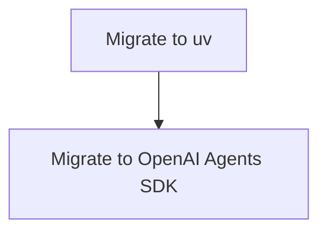

# Implementation Plan: Update to `uv` and OpenAI Agents SDK

**Branch**: `002-update-uv-openai-sdk` | **Date**: 2025-12-02 | **Spec**: [specs/002-update-uv-openai-sdk/spec.md](specs/002-update-uv-openai-sdk/spec.md)
**Input**: Feature specification from `specs/002-update-uv-openai-sdk/spec.md`

## Summary

This plan outlines the steps to replace `poetry` with `uv` for backend dependency management, and to replace `LiteLLM` with the `openai` agents SDK for the AI framework.

## Technical Context

**Language/Version**: Python 3.11+
**Primary Dependencies**: `uv`, `openai`
**Storage**: N/A
**Testing**: `pytest`
**Target Platform**: Backend
**Project Type**: Backend
**Performance Goals**: Dependency installation in under 30 seconds.
**Constraints**: N/A
**Scale/Scope**: N/A

## Constitution Check

*GATE: Must pass before Phase 0 research. Re-check after Phase 1 design.*

- The constitution does not specify a Python dependency manager, so using `uv` is acceptable. (PASS)
- The constitution allows for either OpenAI Agents SDK or LiteLLM. This change is acceptable. (PASS)

## Project Structure

This feature modifies the existing backend project structure. No new directories will be created.

## Work Breakdown Structure (WBS)

- **Epic**: Refactor Backend Tooling
  - **Feature**: Migrate to `uv`
    - **Story**: Developer uses `uv` for dependency management
      - **Task**: Remove `poetry.lock` and `pyproject.toml` `[tool.poetry]` section.
      - **Task**: Generate `requirements.txt` from `pyproject.toml`.
      - **Task**: Update `quickstart.md` with `uv` instructions.
  - **Feature**: Migrate to OpenAI Agents SDK
    - **Story**: Chatbot uses OpenAI Agents SDK
      - **Task**: Replace `LiteLLM` with `openai` in `backend/src/services/rag.py`.
      - **Task**: Update environment variables for OpenAI.

## Milestones

- **Week 1**: Complete migration to `uv`.
- **Week 2**: Complete migration to OpenAI Agents SDK.

## Dependency Graph

## Testing Strategy

- **Unit Tests**: Existing `pytest` tests will be used to verify that the chatbot functionality is preserved.

## Context7 Invocation Checklist

- [ ] `uv`
- [ ] `openai`