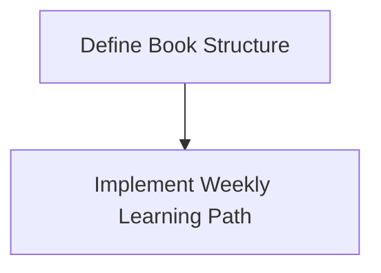

# Implementation Plan: Book Content Structure and Learning Path

**Branch**: `003-book-content-structure` | **Date**: 2025-12-02 | **Spec**: [specs/003-book-content-structure/spec.md](specs/003-book-content-structure/spec.md)
**Input**: Feature specification from `specs/003-book-content-structure/spec.md`

## Summary

This plan outlines the steps to organize the book content into modules and chapters within Docusaurus, and to implement a weekly learning path for readers.

## Technical Context

**Language/Version**: TypeScript 5.x, JavaScript, MDX
**Primary Dependencies**: Docusaurus 3.x, React 19
**Storage**: File-based (MDX files and Docusaurus configuration)
**Testing**: Playwright (E2E) for navigation, Jest/Vitest for React components (if custom components are needed for navigation).
**Target Platform**: Web (Docusaurus)
**Project Type**: Frontend
**Performance Goals**: Fast navigation and content loading.
**Constraints**: Utilize existing Docusaurus features as much as possible for content organization.
**Scale/Scope**: Focus on book content organization and display of learning path.

## Constitution Check

*GATE: Must pass before Phase 0 research. Re-check after Phase 1 design.*

- The constitution explicitly mentions Docusaurus 3.x and "All course content converted to beautiful MDX". This feature directly supports that. (PASS)
- The constitution highlights "Globally or from selected text only" for the AI teaching assistant, which relies on well-structured content. (PASS)

## Project Structure

### Documentation (this feature)

```text
specs/003-book-content-structure/
├── plan.md              # This file
├── research.md          # Research on Docusaurus content organization
├── data-model.md        # How content structure is represented
└── tasks.md             # Detailed tasks for implementation
```

### Source Code (relevant modifications)

- `frontend/docusaurus.config.js`: Configuration for sidebar and plugins.
- `frontend/sidebars.js`: Definition of the book's sidebar navigation.
- `docs/`: MDX files organized into directories for modules/chapters.
- `frontend/src/theme/`: Custom React components for displaying learning path (if needed).

**Structure Decision**: Leverage Docusaurus's existing docs plugin and sidebar generation for content structure. Custom React components will be used for the weekly learning path display if default Docusaurus features are insufficient.

## Work Breakdown Structure (WBS)

- **Epic**: Book Content Structure and Learning Path
  - **Feature**: Define Book Structure
    - **Story**: Content Creator defines modules
      - **Task**: Research Docusaurus directory structure for modules.
      - **Task**: Create placeholder directories for modules in `docs/`.
    - **Story**: Content Creator defines chapters
      - **Task**: Research Docusaurus chapter organization within modules.
      - **Task**: Create placeholder MDX files for chapters.
  - **Feature**: Implement Weekly Learning Path
    - **Story**: Content Creator assigns chapters to weeks
      - **Task**: Determine configuration approach for weekly learning path (e.g., frontmatter, separate config file).
      - **Task**: Implement configuration for a few sample weeks.
    - **Story**: Reader views learning path
      - **Task**: Research Docusaurus sidebar customization for learning path.
      - **Task**: Implement custom sidebar or component to display weekly learning path.

## Milestones (within project timeline)

- **Week 1-2**: Research Docusaurus content structuring, define initial module and chapter layout.
- **Week 3-4**: Implement basic module/chapter navigation and integrate initial content.
- **Week 5-6**: Design and implement weekly learning path display.
- **Week 7-8**: Integrate learning path with content and test navigation.

## Dependency Graph



## Testing Strategy

- **E2E Tests**:
  - `Playwright` will be used to verify navigation through modules, chapters, and the weekly learning path.
- **Manual Review**:
  - Content structure and learning path display will be manually reviewed for correctness and user experience.

## Context7 Invocation Checklist

- [ ] Docusaurus (content organization, sidebar customization, MDX usage)
- [ ] React (custom components for learning path display)