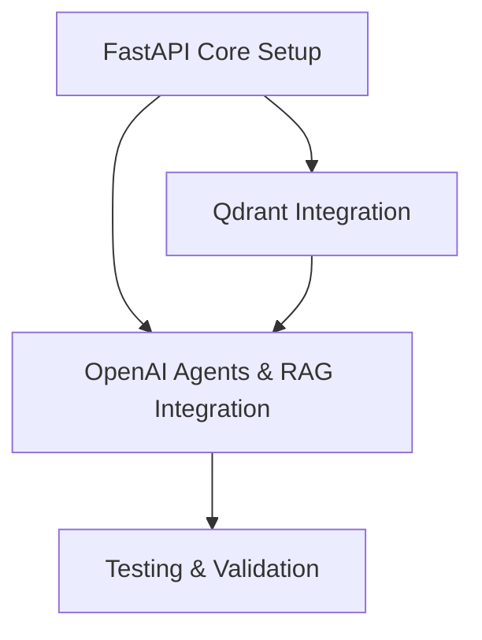

# Implementation Plan: Backend Rewrite for Chatbot with FastAPI, OpenAI Agents, and Qdrant

**Branch**: `004-backend-chatbot-rewrite` | **Date**: 2025-12-02 | **Spec**: [specs/004-backend-chatbot-rewrite/spec.md](specs/004-backend-chatbot-rewrite/spec.md)
**Input**: Feature specification from `specs/004-backend-chatbot-rewrite/spec.md`

## Summary

This plan outlines the development of a new backend for the chatbot using FastAPI, OpenAI Agents, and Qdrant. It will focus on creating API endpoints for chat interaction and content ingestion, integrating with OpenAI for AI capabilities, and utilizing Qdrant for efficient RAG.

## Technical Context

**Language/Version**: Python 3.9+
**Primary Frameworks**: FastAPI
**Key Libraries**: `openai`, `qdrant-client`, `uvicorn`, `pydantic`
**Database**: Qdrant (vector database)
**AI/ML**: OpenAI API (for embeddings and agent interactions)
**Testing**: `pytest`, `httpx` (for API testing)
**Target Platform**: Backend API service
**Project Type**: Backend
**Performance Goals**:
- Chat response time: p95 latency < 2 seconds.
- Content ingestion: Process typical chapter within 5 seconds.
**Constraints**:
- Secure handling of API keys.
- Maintain compatibility with the existing frontend (API contract).
**Scale/Scope**: Focus on core RAG chatbot functionality and content ingestion.

## Constitution Check

*GATE: Must pass before Phase 0 research. Re-check after Phase 1 design.*

- The constitution emphasizes modularity and scalability, which FastAPI, OpenAI, and Qdrant support. (PASS)
- Focus on leveraging AI capabilities for a smarter book, directly addressed by OpenAI Agents and Qdrant RAG. (PASS)

## Project Structure

### Documentation (this feature)

```text
specs/004-backend-chatbot-rewrite/
├── plan.md              # This file
├── research.md          # Research on specific FastAPI/OpenAI/Qdrant patterns
├── data-model.md        # Detailed data models for request/response, Qdrant vectors
└── tasks.md             # Detailed tasks for implementation
```

### Source Code (relevant modifications)

The new backend will reside in the `backend/` directory.

```text
backend/
├── src/
│   ├── main.py                   # FastAPI application entry point
│   ├── api/                      # API endpoint definitions
│   │   ├── __init__.py
│   │   └── chat.py               # Chat endpoint logic
│   │   └── ingest.py             # Content ingestion endpoint logic
│   ├── services/                 # Business logic, OpenAI/Qdrant interactions
│   │   ├── __init__.py
│   │   ├── openai_service.py     # Handles OpenAI API calls (embeddings, chat completions)
│   │   ├── qdrant_service.py     # Handles Qdrant interactions (vector storage, search)
│   │   └── rag_service.py        # Orchestrates RAG pipeline
│   ├── models/                   # Pydantic models for request/response validation
│   │   ├── __init__.py
│   │   └── chat.py               # Chat request/response models
│   │   └── ingest.py             # Ingestion request/response models
│   └── core/                     # Configuration, utilities
│       ├── __init__.py
│       └── config.py             # Settings (API keys, Qdrant URL)
├── tests/                        # Unit and integration tests
│   ├── test_api.py
│   ├── test_services.py
├── requirements.txt              # Python dependencies
├── Dockerfile                    # (Future consideration) Dockerization
└── start_server.ps1              # Script to start the FastAPI server
```

**Structure Decision**: A modular structure for the FastAPI application, separating concerns into `api`, `services`, `models`, and `core` directories. This promotes maintainability and testability.

## Work Breakdown Structure (WBS)

-   **Epic**: Backend Rewrite for Chatbot
    -   **Feature**: FastAPI Core Setup
        -   **Story**: Initialize FastAPI Project
            -   **Task**: Create `backend/src/main.py` with basic FastAPI app.
            -   **Task**: Configure `backend/requirements.txt` and install dependencies.
            -   **Task**: Implement basic `/health` endpoint.
    -   **Feature**: Qdrant Integration
        -   **Story**: Store Book Content in Qdrant
            -   **Task**: Implement `qdrant_service.py` for connection and collection management.
            -   **Task**: Implement content chunking logic.
            -   **Task**: Implement content vectorization using OpenAI embeddings.
            -   **Task**: Implement `/ingest_content` API endpoint to store content.
    -   **Feature**: OpenAI Agents & RAG Integration
        -   **Story**: Chatbot responds with RAG-informed answers
            -   **Task**: Implement `openai_service.py` for chat completions and embeddings.
            -   **Task**: Implement `rag_service.py` to orchestrate Qdrant search and OpenAI response generation.
            -   **Task**: Implement `/chat` API endpoint for conversational interaction.
            -   **Task**: Handle conversational context.
    -   **Feature**: Testing & Validation
        -   **Story**: Ensure API endpoints and services are functional
            -   **Task**: Write unit tests for `openai_service.py` and `qdrant_service.py`.
            -   **Task**: Write integration tests for `/chat` and `/ingest_content` endpoints.

## Milestones (within project timeline)

-   **Week 1**: FastAPI setup, basic health endpoint, environment configuration.
-   **Week 2**: Qdrant integration, content chunking, vectorization, content ingestion endpoint.
-   **Week 3**: OpenAI integration, RAG pipeline, chat endpoint with context.
-   **Week 4**: Comprehensive testing, documentation, and minor refactorings.

## Dependency Graph



## Testing Strategy

-   **Unit Tests**: `pytest` for individual functions and service components.
-   **Integration Tests**: `httpx` and `pytest` for testing API endpoints (`/chat`, `/ingest_content`) end-to-end (excluding external OpenAI/Qdrant services initially, using mocks).
-   **Manual Testing**: Verify chatbot responses and content ingestion flows.

## Context7 Invocation Checklist

-   [ ] FastAPI (app setup, routing, dependency injection, Pydantic)
-   [ ] OpenAI (API usage for chat completions, embeddings)
-   [ ] Qdrant (client usage, collection management, vector search)
-   [ ] `pydantic` (data validation)
-   [ ] `httpx` (async HTTP client for testing)
-   [ ] `pytest` (testing framework)
