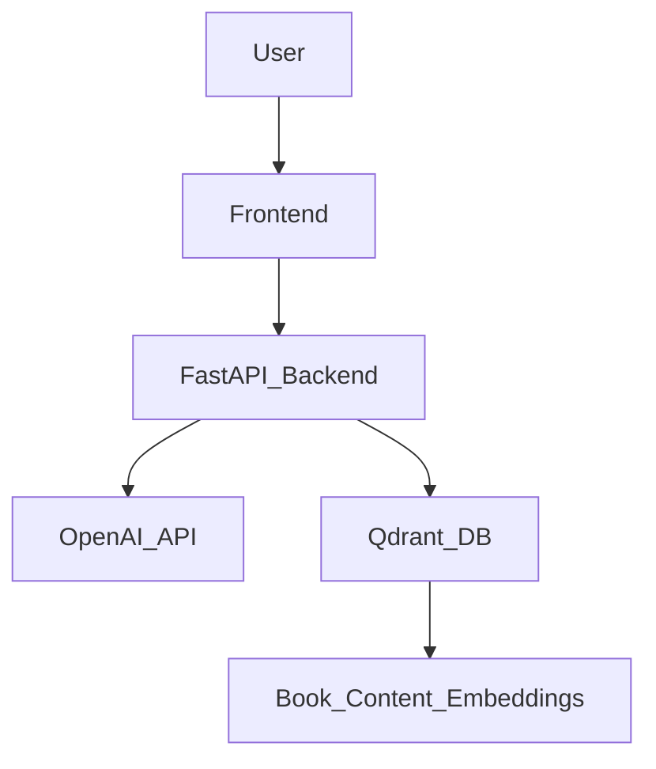

# Feature Specification: Backend Rewrite for Chatbot with FastAPI, OpenAI Agents, and Qdrant

## 1. Introduction

This document outlines the requirements for rewriting the backend of the existing chatbot. The new backend will leverage FastAPI for its API framework, integrate with OpenAI Agents for conversational AI capabilities, and utilize Qdrant as a vector database for efficient semantic search and retrieval. The primary goal is to enhance the chatbot's intelligence, scalability, and maintainability.

## 2. Goals

-   To replace the existing backend with a modern, efficient, and scalable solution using FastAPI.
-   To integrate OpenAI Agents to provide advanced conversational AI.
-   To use Qdrant for storing and retrieving vectorized book content, enabling intelligent RAG (Retrieval-Augmented Generation).
-   To ensure the backend can effectively serve the existing frontend chatbot interface.
-   To improve the overall performance and responsiveness of the chatbot.

## 3. Scope

### In Scope

-   **FastAPI Application**: Development of a FastAPI application to expose API endpoints for chatbot interaction.
-   **OpenAI Agents Integration**: Integration with OpenAI's API for agent-based conversational logic. This includes handling user queries, context management, and generating responses.
-   **Qdrant Integration**: Setup and integration of Qdrant as a vector database for storing embedded book content. This involves:
    -   Indexing book content into Qdrant.
    -   Performing similarity searches in Qdrant based on user queries.
-   **RAG Pipeline**: Implementation of a RAG pipeline that retrieves relevant information from Qdrant and uses it to inform the OpenAI Agent's responses.
-   **API Endpoints**:
    -   `/chat`: Main endpoint for chatbot interaction (receiving user messages, returning AI responses).
    -   `/health`: Health check endpoint.
    -   `/ingest_content`: Endpoint for ingesting and vectorizing new book content into Qdrant.
-   **Error Handling**: Robust error handling for API calls, Qdrant operations, and OpenAI interactions.

### Out of Scope

-   Frontend changes beyond adjusting API endpoint calls.
-   User authentication and authorization (will be handled in a separate feature if required).
-   Complex user session management beyond what OpenAI Agents provide by default.
-   Deployment infrastructure (focused solely on backend application logic).
-   Advanced monitoring and logging solutions (basic logging will be included).

## 4. Key Requirements

### Functional Requirements

-   **FR1: Chatbot Interaction**: The backend must accept user messages via a `/chat` endpoint and return AI-generated responses.
-   **FR2: Conversational Context**: The chatbot should maintain conversational context to provide coherent and relevant responses within a session.
-   **FR3: Content Retrieval**: The chatbot must be able to retrieve relevant book content from Qdrant based on user queries.
-   **FR4: RAG-informed Responses**: AI responses must incorporate information retrieved from Qdrant when relevant.
-   **FR5: Content Ingestion**: An `/ingest_content` endpoint must allow for the submission of new book content (e.g., text, Markdown files) to be vectorized and stored in Qdrant.
-   **FR6: Health Check**: A `/health` endpoint should indicate the operational status of the backend service.

### Non-Functional Requirements

-   **NFR1: Performance**:
    -   Chat response time: p95 latency < 2 seconds.
    -   Content ingestion: Should process a typical chapter within 5 seconds.
-   **NFR2: Scalability**: The backend should be designed to scale horizontally to handle increased user load.
-   **NFR3: Reliability**: The service should be highly available, with appropriate error handling and retry mechanisms for external dependencies (OpenAI, Qdrant).
-   **NFR4: Security**: Sensitive API keys (OpenAI, Qdrant) must be securely managed (e.g., environment variables).
-   **NFR5: Maintainability**: The codebase should be well-structured, documented, and follow best practices for FastAPI applications.

## 5. Architecture Overview

The backend will be a FastAPI application. It will communicate with OpenAI's API for generative AI capabilities, and with a Qdrant instance for vector search.



## 6. Data Model (Conceptual)

-   **User Message**: `string`
-   **AI Response**: `string`
-   **Chat Session**:
    -   `session_id`: `string` (unique identifier)
    -   `messages`: `array` of `{"role": "user" | "assistant", "content": "string"}`
-   **Book Content Chunk**:
    -   `id`: `string` (unique identifier for the chunk)
    -   `text`: `string` (segment of book content)
    -   `embedding`: `array<float>` (vector representation of the text)
    -   `metadata`: `object` (e.g., `{"chapter": "...", "module": "..."}`)

## 7. API Endpoints

### `POST /chat`

-   **Request Body**:
    ```json
    {
        "session_id": "string", // Optional, for continuing a conversation
        "message": "string"
    }
    ```
-   **Response Body (Success 200)**:
    ```json
    {
        "session_id": "string",
        "response": "string"
    }
    ```
-   **Response Body (Error 4xx/5xx)**:
    ```json
    {
        "detail": "string"
    }
    ```

### `POST /ingest_content`

-   **Request Body**:
    ```json
    {
        "content_id": "string", // Unique ID for the content (e.g., chapter ID)
        "text": "string",       // Full text content to be ingested
        "metadata": {           // Optional metadata
            "chapter": "string",
            "module": "string"
        }
    }
    ```
-   **Response Body (Success 200)**:
    ```json
    {
        "status": "success",
        "message": "Content ingested successfully",
        "vector_count": 10 // Number of vectors created from the content
    }
    ```
-   **Response Body (Error 4xx/5xx)**:
    ```json
    {
        "detail": "string"
    }
    ```

### `GET /health`

-   **Response Body (Success 200)**:
    ```json
    {
        "status": "healthy"
    }
    ```
-   **Response Body (Error 5xx)**:
    ```json
    {
        "status": "unhealthy",
        "details": "string"
    }
    ```

## 8. Open Questions / Dependencies

-   Specific OpenAI model to be used (e.g., `gpt-3.5-turbo`, `gpt-4`).
-   Chunking strategy for book content before vectorization.
-   Exact vector embedding model to be used.
-   Deployment environment for Qdrant (local, cloud service).

## 9. Future Considerations

-   User authentication for content ingestion and chat.
-   Advanced conversational features (e.g., tool use, function calling).
-   Integration with other data sources beyond book content.
